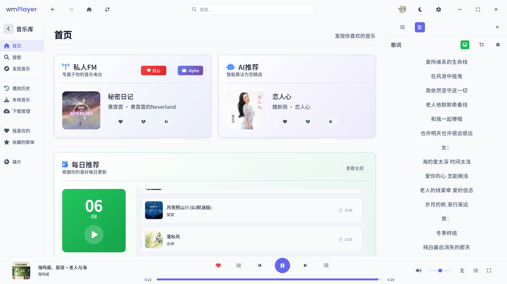
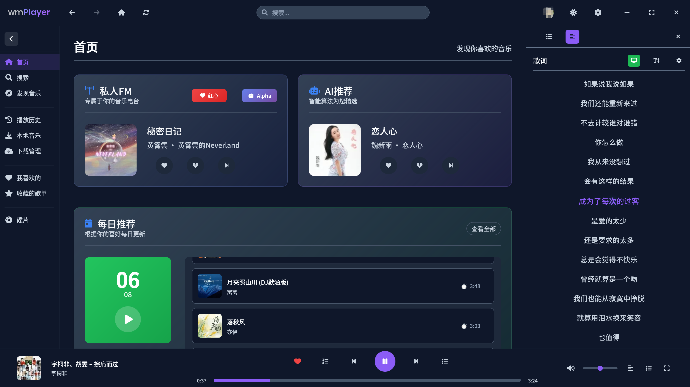
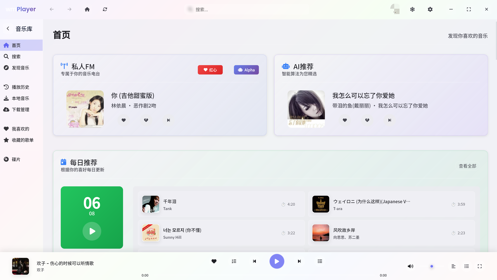
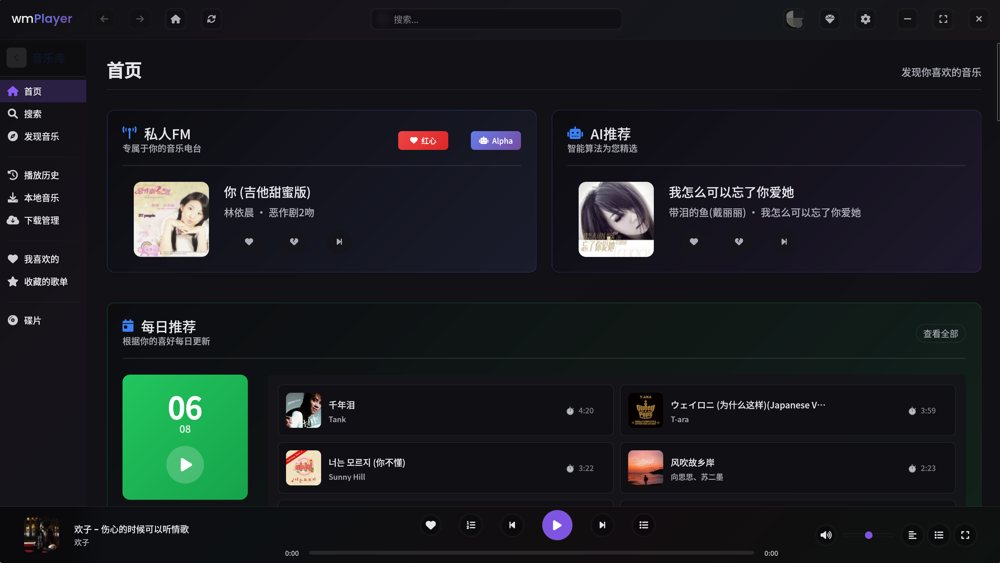
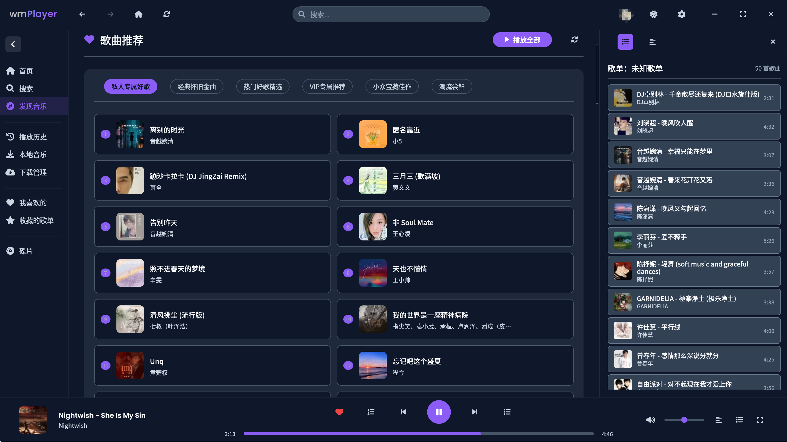
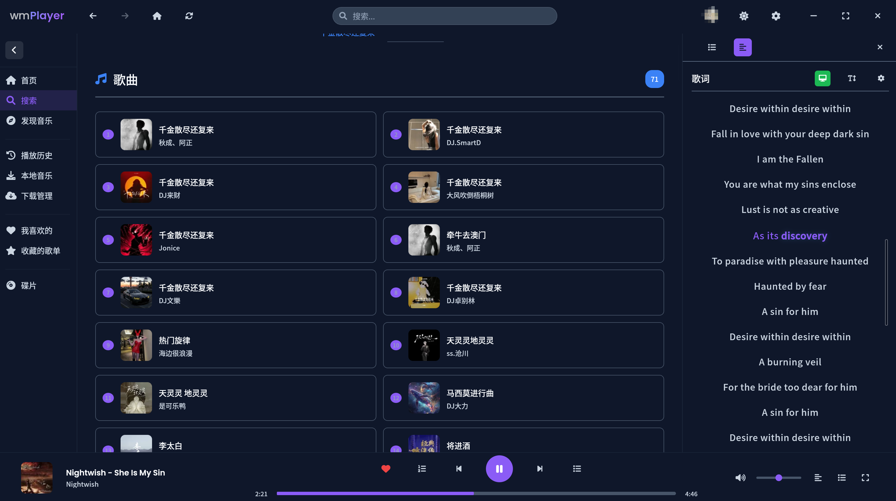
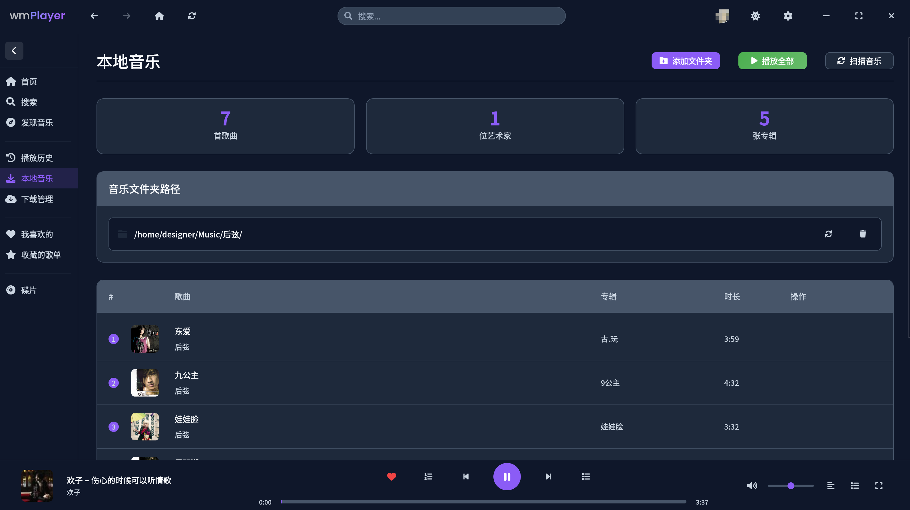
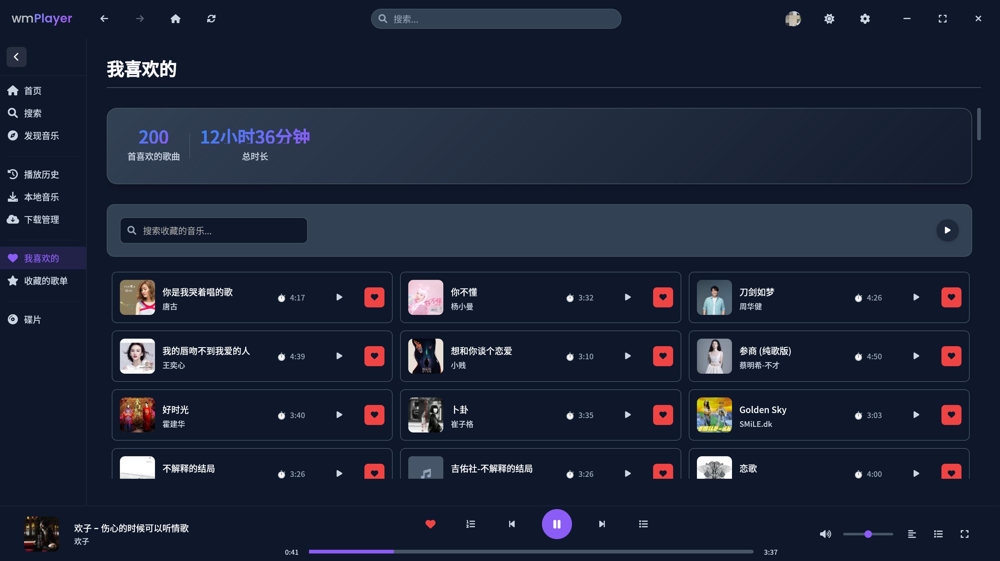
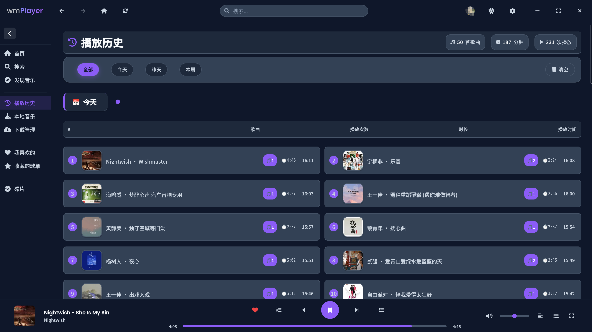
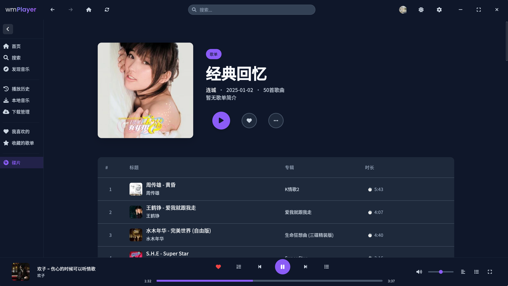

# wmPlayer - 基于 Wails3 的现代音乐播放器

<div align="center">


一个基于 **Wails3** 和 **Go** 技术栈开发的现代化音乐播放器，支持在线音乐播放、本地音乐管理、桌面歌词显示等丰富功能。

[](https://golang.org/)
[](https://wails.io/)
[](LICENSE)

</div>

## 📸 应用截图

<div align="center">

### 主界面





### 发现音乐


### 搜索功能


### 本地音乐


### 我喜欢的音乐


### 播放历史


### 碟片播放


</div>

## ✨ 主要特性

### 🎵 音乐播放
- **在线音乐**: 支持酷狗音乐 API，海量音乐资源
- **本地音乐**: 支持 MP3、FLAC 等多种音频格式
- **高音质**: 支持无损音质播放
- **播放控制**: 播放/暂停、上一首/下一首、随机播放、循环播放

### 🎨 用户界面
- **现代化设计**: 基于 Web 技术的现代化界面
- **多主题支持**: 浅色、深色、毛玻璃等多种主题
- **响应式布局**: 自适应不同屏幕尺寸
- **无边框窗口**: 自定义标题栏，更加美观

### 🎤 歌词功能
- **桌面歌词**: 独立的 OSD 歌词显示程序
- **KDE Plasma 集成**: 专为 KDE 桌面环境优化的歌词插件
- **多格式支持**: 支持 LRC 和 KRC (卡拉OK) 格式
- **实时同步**: 通过 SSE 实现歌词实时同步

### 🔧 系统集成
- **媒体键支持**: 支持键盘媒体键控制
- **系统托盘**: 最小化到系统托盘，支持托盘菜单控制
- **自动启动**: 支持开机自动启动
- **跨平台**: 支持 Windows、macOS、Linux

### 📚 音乐管理
- **搜索功能**: 支持歌曲、专辑、歌手、歌单搜索
- **收藏管理**: 收藏歌曲、专辑、歌单
- **播放历史**: 记录播放历史
- **歌单管理**: 创建和管理个人歌单
- **本地扫描**: 自动扫描本地音乐文件

## 🚀 快速开始

### 环境要求

- **Go**: 1.24.0 或更高版本
- **Node.js**: 用于前端构建
- **Wails3**: v3.0.0-alpha.17
- **操作系统**: Windows 10+, macOS 10.15+, Linux (Ubuntu 18.04+)

### 安装依赖

``` bash
# 安装api -[酷狗API](https://github.com/MakcRe/KuGouMusicApi)
export platform=lite
export PORT=40000
./KuGouMusicApi
```

```bash
# 克隆项目
git clone <repository-url>
cd wmplayer

# 安装 Go 依赖
go mod tidy

# 安装前端依赖
cd frontend
npm install
cd ..
```

### 开发模式

```bash
# 启动开发服务器
wails3 dev
```

### 构建应用

```bash
# 构建应用
wails3 build
```

### 打包发布

```bash
# 打包应用
task package
```

## 📁 项目结构

```
wmplayer/
├── main.go                    # 应用入口
├── go.mod                     # Go 模块文件
├── Taskfile.yml              # Task 构建配置
├── build/                     # 构建配置
│   └── config.yml            # Wails 配置文件
├── frontend/                  # 前端代码
│   ├── index.html            # 主页面
│   ├── app.js                # 应用入口
│   ├── *.js                  # 各功能模块
│   └── dist/                 # 构建输出
├── lyric/                     # 歌词系统
│   ├── osdlyric/             # OSD 桌面歌词
│   └── plasma-lyrics/        # KDE Plasma 歌词插件
├── public/                    # 静态资源
├── *service.go               # 后端服务模块
└── README.md                 # 项目文档
```

## 🎵 歌词系统

wmPlayer 提供了两种歌词显示方案：

### 🖥️ OSD 桌面歌词

独立的桌面悬浮歌词程序，支持：
- 透明度调节 (0.01-0.90)
- 字体大小调节 (12-48px)
- 文字颜色自定义
- 窗口锁定/解锁
- 拖拽移动和调整大小

```bash
cd lyric/osdlyric
make
./osd_lyrics 
```

### 🎨 KDE Plasma 歌词插件

专为 KDE Plasma 桌面环境设计的歌词插件：
- 完美集成 Plasma 桌面
- 卡拉OK 效果支持
- 自适应主题
- 平滑动画效果

```bash
cd lyric/plasma-lyrics
./install.sh
```

## 🔧 配置说明

### 应用配置

应用配置文件位于用户目录下的 `.wmplayer/` 文件夹中，包含：
- 播放设置（自动播放、音量等）
- 界面设置（主题、语言等）
- 行为设置（关闭行为、自动启动等）

### 歌词配置

歌词系统通过 SSE (Server-Sent Events) 与主应用通信：
- **端点**: `http://127.0.0.1:18911/api/osd-lyrics/sse`
- **格式**: JSON
- **支持格式**: LRC、KRC

## 🎯 功能模块

### 登录服务 (LoginService)
- 手机验证码登录
- 二维码登录
- 微信登录
- 用户状态管理

### 搜索服务 (SearchService)
- 歌曲搜索
- 专辑搜索
- 歌手搜索
- 歌单搜索

### 播放服务
- 音频解码
- 播放控制
- 音量控制
- 播放模式

### 本地音乐服务 (LocalMusicService)
- 本地文件扫描
- 元数据提取
- 封面提取
- 音乐库管理

### 缓存服务 (CacheService)
- 音乐缓存
- 封面缓存
- HTTP 服务器
- SSE 推送

## 🛠️ 开发指南

### 添加新功能

1. **后端服务**: 在根目录创建 `*service.go` 文件
2. **前端模块**: 在 `frontend/` 目录创建对应的 JS 文件
3. **注册服务**: 在 `main.go` 中注册新服务

### 调试技巧

```bash
# 查看详细日志
wails3 dev -loglevel debug
```

### 构建优化

- 使用 `task build` 进行优化构建
- 前端资源会自动压缩和打包
- Go 代码会进行交叉编译

## 🤝 贡献指南

1. Fork 本项目
2. 创建功能分支 (`git checkout -b feature/AmazingFeature`)
3. 提交更改 (`git commit -m 'Add some AmazingFeature'`)
4. 推送到分支 (`git push origin feature/AmazingFeature`)
5. 创建 Pull Request

## 📄 许可证

本项目采用 GPL-3.0 许可证 - 查看 [LICENSE](LICENSE) 文件了解详情。

## ⚠️ 免责声明
本程序是酷狗第三方客户端，并非酷狗官方，需要更完善的功能请下载官方客户端体验.
本项目仅供学习使用，请尊重版权，请勿利用此项目从事商业行为及非法用途！
使用本项目的过程中可能会产生版权数据。对于这些版权数据，本项目不拥有它们的所有权。为了避免侵权，使用者务必在 24 小时内清除使用本项目的过程中所产生的版权数据。
由于使用本项目产生的包括由于本协议或由于使用或无法使用本项目而引起的任何性质的任何直接、间接、特殊、偶然或结果性损害（包括但不限于因商誉损失、停工、计算机故障或故障引起的损害赔偿，或任何及所有其他商业损害或损失）由使用者负责。
禁止在违反当地法律法规的情况下使用本项目。对于使用者在明知或不知当地法律法规不允许的情况下使用本项目所造成的任何违法违规行为由使用者承担，本项目不承担由此造成的任何直接、间接、特殊、偶然或结果性责任。
音乐平台不易，请尊重版权，支持正版。
本项目仅用于对技术可行性的探索及研究，不接受任何商业（包括但不限于广告等）合作及捐赠。
如果官方音乐平台觉得本项目不妥，可联系本项目更改或移除。

## 🙏 致谢

- [Wails](https://wails.io/) - 跨平台桌面应用框架
- [酷狗音乐 API](https://github.com/MakcRe/KuGouMusicApi) - 音乐数据来源
- 所有贡献者和用户的支持

## 💬 交流群组

- [Telegram 群组](https://t.me/+EzW5VV8YtOhhMjQ1) - 加入我们的 Telegram 群组进行交流讨论

---

<div align="center">

**如果这个项目对你有帮助，请给它一个 ⭐**

</div>