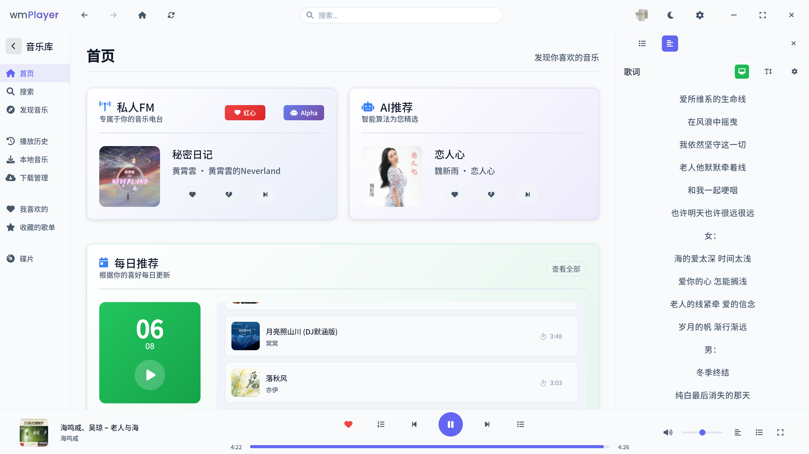
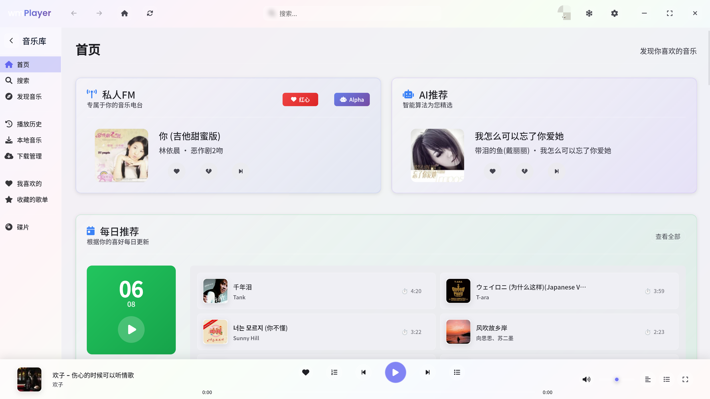
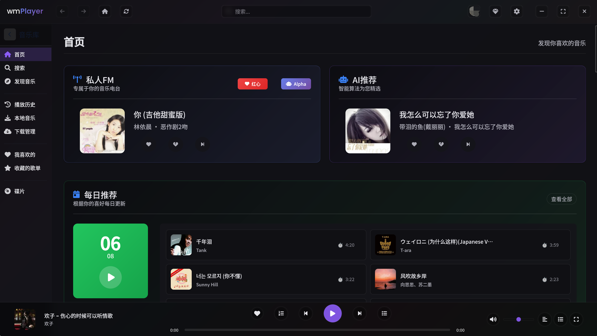
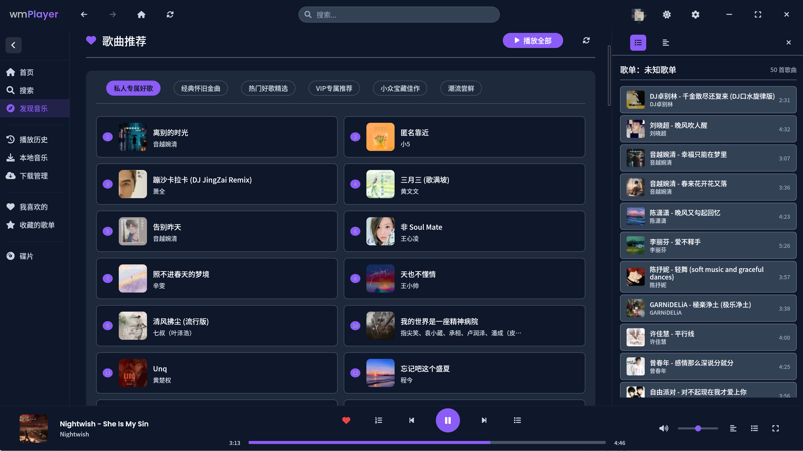
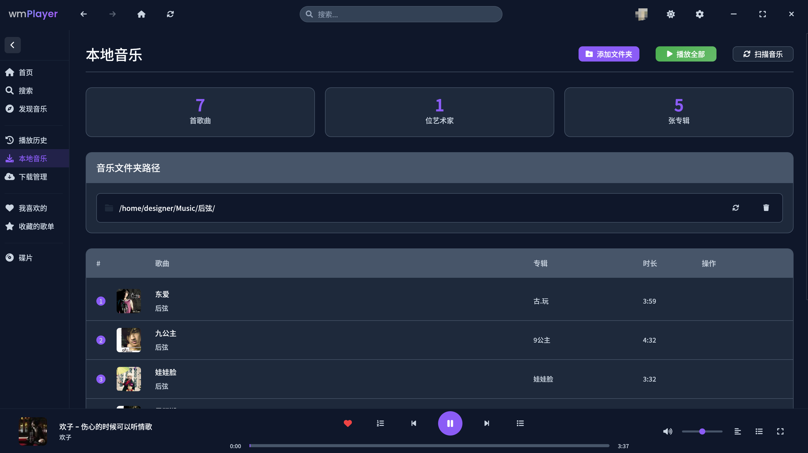
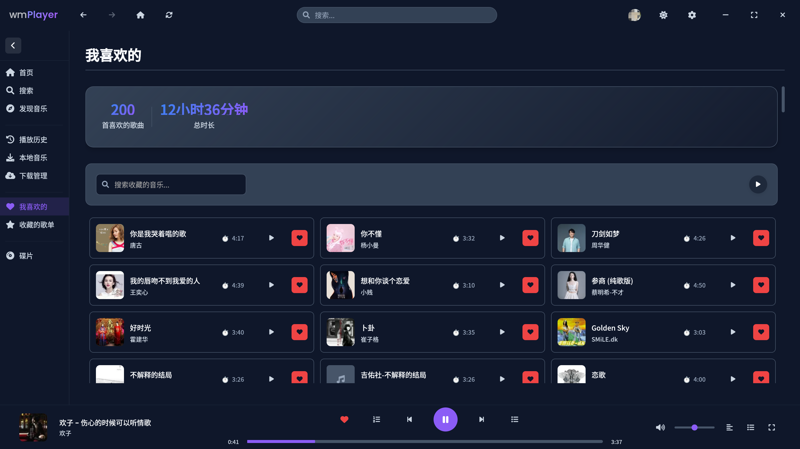
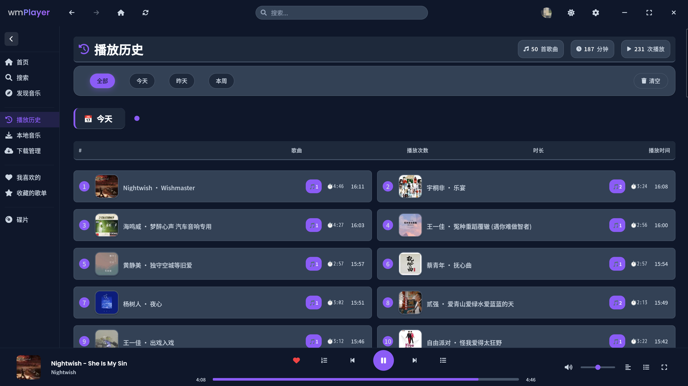

# wmPlayer - 基于 Wails3 的现代化跨平台音乐播放器

<div align="center">


一个基于 **Wails v3** (Go 1.25+) 与 **原生 Web 前端** 构建的高性能现代化音乐播放器。支持在线音乐流媒体、本地音乐库智能管理、OSD 桌面悬浮歌词与 KDE Plasma 桌面集成。

[](https://golang.org/)
[](https://wails.io/)
[](https://github.com/lianchengwu/lmplayer/actions)
[](LICENSE)

[功能特性](#-主要特性) • [应用截图](#-应用截图) • [歌词扩展](#-歌词系统与外部扩展) • [快速开始](#-快速开始) • [CI 与发布](#-持续集成与跨平台发布) • [目录结构](#-目录结构) • [免责声明](#-免责声明)

</div>

---

## 📸 应用截图

<div align="center">

### 主界面主题
| 浅色主题 | 深色主题 |
| :---: | :---: |
|  |  |
| **毛玻璃浅色** | **磨砂深色** |
|  |  |

### 核心功能体验
| 发现音乐 | 全能搜索 |
| :---: | :---: |
|  |  |
| **本地音乐库** | **我喜欢的音乐** |
|  |  |
| **播放历史** | **碟片沉浸播放** |
|  |  |

</div>

---

## ✨ 主要特性

### 🎵 音乐播放与在线生态
- **在线音乐检索**：支持海量歌曲、专辑、歌手、精选歌单搜索与推荐（每日推荐、个性化 FM、AI 推荐）。
- **开箱即用 & 自动后台管理**：内置 API 服务进程管理器，应用启动时自动拉起并守护 `KuGouMusicApi`，应用退出时自动回收，免除手动部署的繁琐。
- **高性能 HTTP 连接池**：内置全局 Keep-Alive 与 TCP 连接复用池，大幅降低切歌、搜索与歌词加载延迟。
- **高音质流媒体播放**：支持多种音频品质流式播放，集成断点自动重试与防盗链代理。

### 📂 本地音乐智能库
- **系统原生目录选择**：接入 Wails v3 原生系统文件夹对话框，直接选择物理磁盘目录，无需手动输入绝对路径。
- **元数据与封面自动提取**：支持 MP3、FLAC、WAV 等格式的 ID3 标签读取，秒级解析流派、比特率，自动提取并缓存内嵌专辑高清封面与本地 `.lrc` 歌词。
- **毫秒级拖拽跳转**：本地内置轻量级 HTTP 服务支持 `HTTP 206 Partial Content` 分段请求，播放大型无损音频时零内存堆积、进度拖拽秒响应。

### 🎨 现代化界面与离线化设计
- **完全离线可用**：全部 FontAwesome 图标及 WebFonts 字体资产实现本地化打包，在断网/离线环境下界面图标 100% 正常渲染。
- **沉浸式全屏播放**：支持黑胶碟片动效、逐字平滑变色歌词展示。
- **多套高颜值主题**：浅色、深色、毛玻璃浅色、磨砂深色一键即时切换。

### 🎤 独立歌词系统 (OSD & Plasma)
- **多格式歌词解析**：支持标准 LRC 歌词与卡拉OK逐字高亮 KRC 格式。
- **SSE 跨进程广播**：通过内置端口实时向外部独立进程分发歌词流。
- **独立 OSD 桌面悬浮歌词**：支持透明度调节 (0.01~0.90)、字体缩放 (12~48px)、自定义色彩与窗口锁定。
- **KDE Plasma 桌面小部件**：深度适配 Linux KDE Plasma 桌面环境。

### 🔧 桌面系统深度集成
- **Linux MPRIS 规范**：实现 `org.mpris.MediaPlayer2` D-Bus 接口，无缝接入系统多媒体托盘与锁屏控制中心。
- **多媒体按键支持**：支持键盘播放/暂停、上一曲、下一曲全局快捷键。
- **系统托盘控制**：后台最小化运行、托盘菜单控制切歌与收藏。
- **智能缓存配额**：内置 2GB 缓存配额监控与 LRU 自动淘汰机制，防止磁盘空间无节制增长。
- **独立歌词扩展仓库**：配套开源 [wmplayer-lyric](https://github.com/lianchengwu/wmplayer-lyric) 桌面歌词与 KDE Plasma 插件。
---

## 🚀 快速开始

### 📋 环境要求

- **Go**: `1.25.0` 或更高版本
- **Node.js**: `v18.0.0` 或更高版本（推荐 v20+）
- **Wails 3 CLI**: `v3.0.0-beta.16`（通过 `go install github.com/wailsapp/wails/v3/cmd/wails3@latest` 安装）
- **操作系统**：
  - **Linux**: Ubuntu 22.04+ / Debian 12+ / openSUSE / Arch Linux（需安装 `libgtk-4-dev`、`libwebkitgtk-6.0-dev`、`libsoup-3.0-dev`）
  - **Windows**: Windows 10 / 11（内置 WebView2）
  - **macOS**: macOS 10.15+ (Catalina 或更高)

---

### 💻 本地开发

```bash
# 1. 克隆项目
git clone https://github.com/lianchengwu/lmplayer.git
cd lmplayer

# 2. 安装 Wails3 CLI (若尚未安装)
go install github.com/wailsapp/wails/v3/cmd/wails3@latest

# 3. 安装 Go 依赖与前端依赖
go mod tidy
cd frontend && npm install && cd ..

# 4. 生成服务绑定
wails3 generate bindings .

# 5. 启动开发模式 (热重载)
wails3 dev
```

---

### 📦 构建与打包

```bash
# 构建前端
cd frontend && npm run build && cd ..

# 生成 Wails 绑定
wails3 generate bindings .

# 编译应用二进制
wails3 build
# 产物输出在 bin/ 目录下
```

---

## 🤖 持续集成与跨平台发布

本项目已配置完整的 **GitHub Actions CI/CD 流水线** (`.github/workflows/build-and-release.yml`)，支持自动打包 Linux、Windows 和 macOS：

### 自动发布流程
只需向仓库推送以 `v` 开头的版本标签，CI 将全自动完成三端编译打包，并创建带有完整资产的 GitHub Release：

```bash
git tag v1.0.0
git push origin v1.0.0
```

| 平台 | 架构 | 生成的安装包 |
| :--- | :--- | :--- |
| **Linux** | x86_64 | `wmplayer-linux-amd64.tar.gz` (内置应用 + API 服务) |
| **Windows** | x86_64 | `wmplayer-windows-amd64.zip` (内置 `wmplayer.exe` + `KuGouMusicApi.exe`) |
| **macOS** | Universal (Intel / Apple Silicon) | `wmplayer-darwin-universal.zip` (`wmplayer.app` Bundle) |

---

## 🎵 歌词系统与外部扩展

wmPlayer 通过内置的 SSE (Server-Sent Events) 服务器向外部歌词进程实时广播歌词流，并提供了独立的桌面歌词与桌面插件扩展：

* **歌词扩展开源仓库**：👉 [wmplayer-lyric](https://github.com/lianchengwu/wmplayer-lyric)

### 🖥️ OSD 桌面悬浮歌词
独立的桌面透明悬浮歌词程序，支持：
- 透明度调节 (`0.01` ~ `0.90`)
- 字体缩放 (`12px` ~ `48px`)
- 文字颜色、卡拉OK逐字高亮色彩自定义
- 窗口锁定/解锁、自由拖拽移动和调整尺寸

```bash
# 编译并运行 OSD 桌面歌词
git clone https://github.com/lianchengwu/wmplayer-lyric.git
cd wmplayer-lyric/osdlyric
make
./osd_lyrics
```

### 🎨 KDE Plasma 桌面歌词挂件
专为 Linux KDE Plasma 桌面环境深度打造的桌面小部件：
- 无缝嵌入 Plasma 任务栏或桌面
- 支持卡拉OK动态变色与自适应桌面主题
- 超低资源占用与丝滑平移动画

```bash
# 安装 KDE Plasma 桌面歌词插件
cd wmplayer-lyric/plasma-lyrics
./install.sh
```

### 📡 歌词通信协议
- **SSE 端点**：`http://127.0.0.1:18911/api/osd-lyrics/sse`
- **数据格式**：实时分发经过解析的 LRC / KRC JSON 格式数据流

## 📁 目录结构

```text
wmplayer/
├── .github/
│   └── workflows/
│       └── build-and-release.yml    # GitHub Actions 跨平台全自动构建与发布流
├── build/                           # 平台构建配置与图标
│   ├── config.yml                   # Wails 3 项目元配置
│   ├── linux/                       # Linux 打包模板 (Desktop, AppImage, nfpm)
│   ├── windows/                     # Windows 打包模板 (NSIS, Syso, Manifest)
│   └── darwin/                      # macOS 打包模板 (Info.plist, Icons)
├── frontend/                        # 前端 Web 源码
│   ├── index.html                   # 主界面骨架
│   ├── app.js / main.js             # 界面逻辑与模块分发
│   ├── unified-player-controller.js # 统一播放状态控制器
│   ├── html5-audio-player-unified.js# HTML5 音频引擎核心
│   ├── local.js / search.js ...     # 各页面交互模块
│   └── bindings/                    # Wails 3 自动生成的 Go-JS 服务绑定
├── main.go                          # 应用入口与生命周期管理
├── apiservice.go                    # KuGouMusicApi 子进程自动管理与守护
├── config.go                        # 全局配置、HTTP 连接池与跨平台路径管理
├── cacheservice.go                  # 本地 HTTP 代理、LRU 缓存淘汰与 SSE 歌词服务
├── localmusicservice.go             # 本地音乐扫描、ID3 标签解析与封面提取
├── mprisservice.go                  # Linux D-Bus MPRIS 规范实现
├── mediakeyservice.go               # 硬件多媒体按键支持
├── loginservice.go                  # 登录认证与用户状态服务
├── searchservice.go                 # 音乐搜索与关键词联想服务
├── homepageservice.go               # 推荐、FM 与歌曲 URL 解析服务
├── discoverservice.go               # 发现音乐与榜单服务
├── albumservice.go                  # 专辑与歌单详情服务
├── playlistservice.go               # 播放列表与循环模式服务
├── favoritesservice.go              # 用户收藏夹服务
├── playhistoryservice.go            # 播放历史记录服务
├── downloadservice.go               # 音乐下载管理服务
├── cookiemanager.go                 # 跨平台 Cookie 安全持久化
└── README.md                        # 项目文档
```

---

## 🔧 运行与配置说明

### 配置文件位置
应用遵循跨平台标准规范自动选择存储目录（并自动向前兼容历史配置）：
* **Linux / macOS**: `~/.config/wmplayer/` (缓存位于 `~/.cache/wmplayer/`)
* **Windows**: `%APPDATA%\wmplayer\` (缓存位于 `%LOCALAPPDATA%\wmplayer\`)

### 环境变量覆盖
* `WMPLAYER_API_URL`：自定义后端 API 地址（默认：`http://127.0.0.1:40000`）

---

## 📄 许可证

本项目采用 **GPL-3.0** 许可证开源 - 查看 [LICENSE](LICENSE) 文件了解完整详情。

---

## ⚠️ 免责声明

### 关于本项目
- 本程序是基于公开 API 接口开发的第三方跨平台客户端，**并非官方客户端**；
- 如需更完善的功能与官方支持，请下载[酷狗音乐官方客户端](https://www.kugou.com/)体验。

### 使用声明
- 本项目**仅供个人学习与编程技术研究使用**，请尊重音乐版权；
- **严禁**将本项目用于任何商业盈利活动或非法用途；
- 音乐平台创作不易，请尊重版权，**支持正版**。

### 版权声明
- 使用本项目的过程中可能会产生网络版权数据，**本项目不拥有任何音频及图文内容的所有权**；
- 为避免侵权风险，使用者**务必在 24 小时内**清除使用本项目的过程中所产生的缓存与版权数据。

### 其他说明
- 本项目**不接受**任何形式的商业合作、广告赞助或商业捐赠；
- 如官方音乐平台对本项目有任何异议，请通过 GitHub Issues 联系我们，我们将积极配合处理。

---

## 🙏 致谢

- [Wails](https://wails.io/) - 极简高性能的 Go 跨平台桌面框架
- [KuGouMusicApi](https://github.com/MakcRe/KuGouMusicApi) - 优质的 Node.js 音乐数据接口服务
- [Font Awesome](https://fontawesome.com/) - 丰富完备的矢量图标库
- [wmplayer-lyric](https://github.com/lianchengwu/wmplayer-lyric) - 配套桌面歌词与 Plasma 插件系统

---

## 💬 交流群组

- **Telegram 群组**：[加入讨论交流](https://t.me/+EzW5VV8YtOhhMjQ1)

---

<div align="center">

**如果 wmPlayer 对你有帮助，欢迎点亮右上角的 ⭐️ Star 支持本项目！**
</div>
